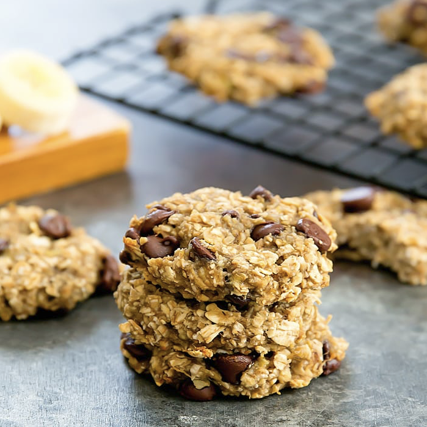

# 2 Ingredient Banana Oatmeal Cookies

## Ingredients
- 1 cup quick oats (see note)
- 1 large overripe banana, mashed to a liquid-like consistency
- 1/2 cup chocolate chips or other add-ins of your choice (optional)

## Steps
1. **Preheat Oven**: Preheat oven to 350°F. Line a baking sheet with a silicone baking mat.
2. **Prepare Batter**: In a large bowl, add oats and mashed banana. Mix with a fork until it becomes an evenly mixed, thick batter. If using add-ins like chocolate chips, mix them into the batter now.
3. **Shape Cookies**: Make 8 round balls out of the batter. Place onto baking sheet, spacing about 2 inches apart. Gently press down on each ball so that it flattens into a round disc. Note that cookies will not spread much during baking.
4. **Bake**: Bake for about 15 minutes or until cookies are lightly brown and set. Cookie bottoms should also be brown and easily come off the baking sheet. Let cookies cool before eating.

## Notes
- Use quick oats for best results, as old-fashioned and steel-cut oats need more time to cook.
- Store uneaten cookies in the fridge.
