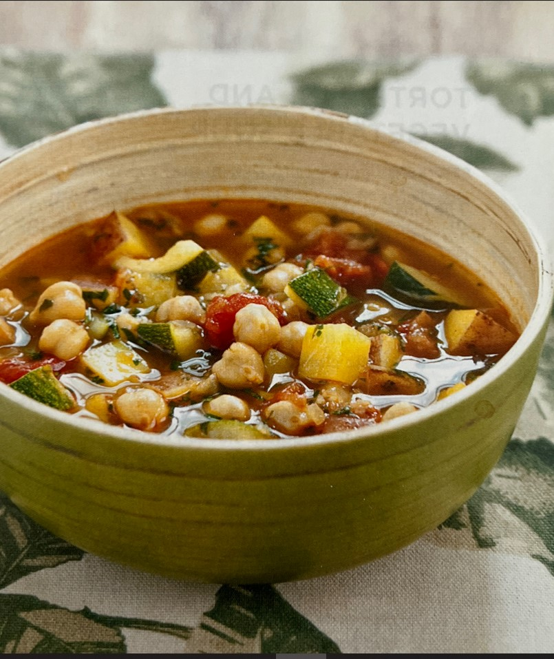

# Moroccan Chickpea Soup

## Ingredients
- 1 T canola oil
- 1 onion, minced
- 1 t sugar
- 4 garlic cloves, minced
- 1/2 t hot paprika (can substitute 1/2 t paprika and a pinch of cayenne pepper)
- 1/4 t saffron threads, crumbled
- 1/4 teaspoon ground ginger
- 1/4 teaspoon ground cumin
- 2 (15-ounce) cans chickpeas, rinsed
- 1 lb red potatoes (about 3 medium), scrubbed and cut into 1/2 inch pieces
- 1 (14.5-ounce) can diced tomatoes
- 4 cups low-sodium chicken broth
- 1 zucchini, seeded and cut into 1/2 inch pieces
- 1/4 cup minced fresh parsley
- Salt & Pepper
- Lemon wedges (for serving)

## Steps
1. Heat the oil in a large Dutch oven over medium-high heat until shimmering.  Add the onion and sugar and cook until softened, about 5 minutes.  Stir in the garlic, paprika, saffron, ginger, and cumin and cook until fragrant, about 30 seconds.

2. Stir in the chickpeas, potatoes, tomatoes with their juice, and broth.  Bring to a simmer, partially cover, and cook until the potatoes are tender, about 20 minutes.  Stir in the zucchini and continue to simmer until tender, 5 to 10 minutes.

3. Mash some of the potatoes against the side of the pot with a spoon to thicken the soup slightly.  Stir in the parsley and season with salt and pepper to taste.  Serve with lemon wedges.

## Notes
- The soup can be cooled and refrigerated in an airtight container for up to 3 days or frozen up to 1 month.  Thaw (if frozen), and reheat over low heat (do not boil)