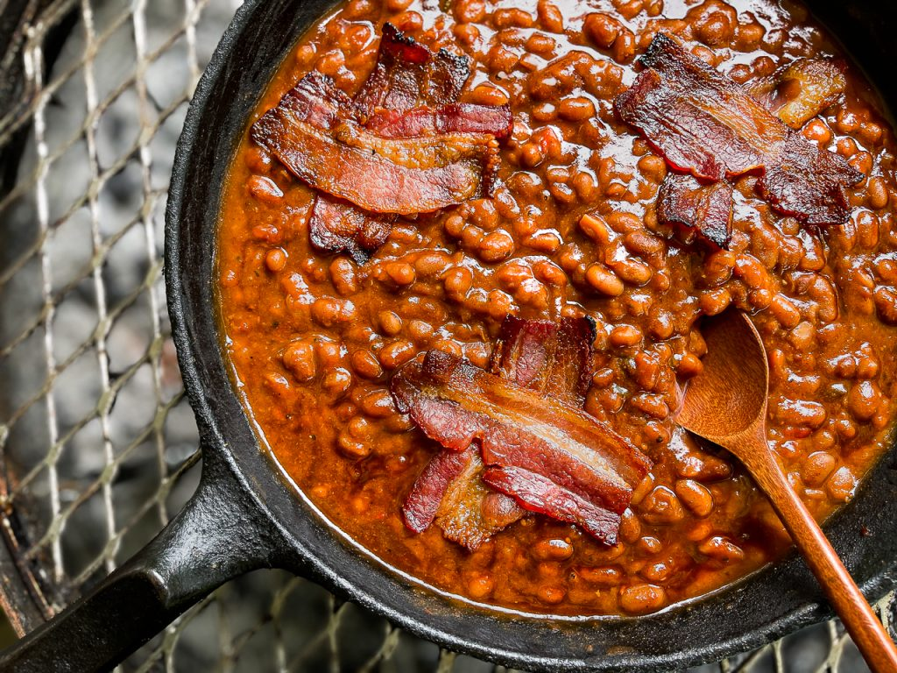

# Apple Pie Baked Beans

## Ingredients
- 16 ounce no sugar added apple pie filling
- 55 ounce can Bush's original baked beans
- 1/2 cup favorite BBQ sauce
- 2 tablespoons favorite BBQ rub/seasoning plus extra for topping
- 1 lb ground sausage
- 1/2 onion, chopped
- 1/2 bell pepper, chopped
- jalapeño, chopped
- garlic, chopped

## Steps
1. Heat your oven, grill or smoker to about 325°.

2. Empty the pie filling in an aluminum pan OR 13×9 baking dish, plus 2 tablespoons of the BBQ seasoning and BBQ sauce.

3. Very gently, using an immersion blender, blend up the apples but not entirely. You don't want apple puree, you just want to loosen it a little bit. If you don't have an immersion blender, place into a food processor or blender and pulse for a few seconds.

4. Brown sausage in a heavy skillet.  

5. Saute the onion, bell pepper, garlic, and jalapeños in the sausage grease until softened.

6. Add the canned baked beans, onion, bell pepper, garlic, and jalapeños. Stir to combine.

7. Place in your preheated oven, grill or smoker and cook for 1.5 hours.

## Notes
- Alternative: Instead of sausage, lay strips of bacon over the beans to cook while the beans cook.