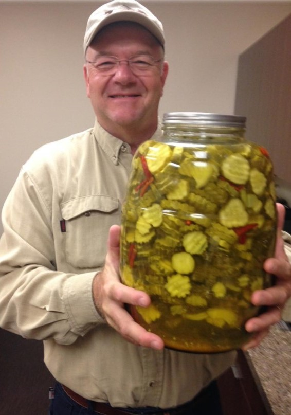

# Aunt Betty's Refrigerator Pickles

## Ingredients
- 6 cups water
- 1 cup 90 grain (9%) white pickling vinegar
- 1/3 cup pickling salt
- 1/2 teaspoon ground mustard
- 1/2 teaspoon turmeric
- 1 teaspoon alum
- 1 gallon cucumbers (sliced or whole), cauliflower, green beans, peppers, jalapenos, etc.
- Minced garlic
- Fresh dill
- Dried hot peppers

## Steps
1. Add 1-2 tablespoons of minced garlic, 3-5 dried hot peppers, and some dill per each quart jar. (adjust if you are
using a larger jar)
2. Wash and cut vegetables and pack in jars leaving ½ inch at the top.
3. Combine first 6 ingredients and bring to a boil.
4. Ladle or pour hot liquid over vegetables to cover and let cool for 2-3 hours until reaching room temperature.
5. Screw lids on and refrigerate for 24 hours before serving.
6. Pickles will keep for 2-3 weeks in the refrigerator and flavor will intensify over time.

## Notes
- Turmeric will stain (yellow) utensils and countertops!