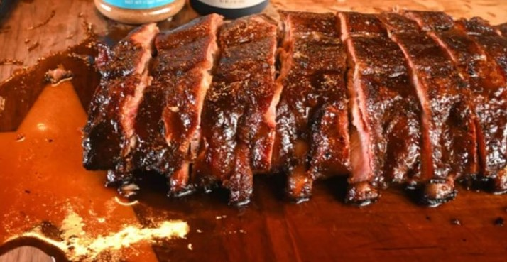

# Baby Back Ribs

## Ingredients
- 1 rack baby back ribs (loin ribs)
- BBQ seasoniong rub of choice
- 1 T yellow mustard
- BBQ Sauce
- 1 T honey
- 1/4 C brown sugar
- 1/4 C unsalted butter, cut into parts

## Videos
- https://youtu.be/DZiRcWvqp68

## Steps
1. Peel membrane from bone side of ribs using paper towel.  Trim excess fat and meat that would otherwise burn up.

2. Coat with mustard binder.  Season liberally wth BBQ rub.  Let seasoning adhere for 15 to 60 minutes.

4. Prepare your smoker at a temp of 275ºF degrees. I like pecan wood, but cherry, apple, or hickory would also be good. We are looking for a heavy smoke wood on this cook. 

5. Place the ribs meat side up in the smoker.  Smoke until ribs turn mahagony color (approx. 2.5 hours).  Spritz with apple cider vinegar if necessary if ribs are getting dried out.

6. Wrap ribs in 2 sheets of aluminum foil with butter, brown sugar, and honey.

7. Smoke until meat starts to pull away from the bone.  Approx. 203º-205ºF.

8. Remove from smoker.  Open foil and mold into a foil boat, exposing the top of the ribs.  Apply BBQ sauce.

9. Smoke for 10 minutes to tack up the sauce.

10. Allow a few minutes rest to cool.  Slice and eat.

## Notes
