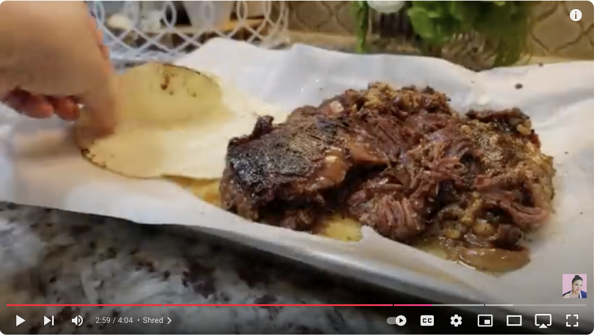

# Barbacoa

## Ingredients
- 3 lbs beef cheeks
- 2 to 2 1/2 tsp salt (or to taste)
- 2 large dried bay leaves
- 1/2 of a small to medium onion
- 4 cloves garlic
- 1/2 tsp black pepper
- 4.5 quart slow cooker

## Steps
1. **Prepare Ingredients**: Place all ingredients into a 4.5-quart slow cooker.
2. **Cook**: Set the slow cooker to low and cook for 11 to 12 hours.
3. **Serve**: Remove the meat, keeping it whole and covered until ready to serve. The meat should shred easily, making it ideal for tacos.

## Notes
- Smoke the beek cheeks for 2-3 hours before adding to the crockpot for extra flavor
- Barbacoa is a classic, tender shredded beef that’s perfect for tacos or burritos. Adjust seasoning if needed before serving.
