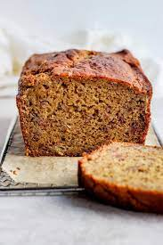

# Better-For-You Banana Bread

## Ingredients
- 1 1/4 cups (6 1/4 ounces) all-purpose flour
- 1/2 cup (2 3/4 ounces) whole wheat flour
- 3/4 cup (5 1/4 ounces) sugar
- 2 t baking powder
- 3/4 t baking soda
- 1/2 t salt
- 1/4 t ground cinnamon
- 1/4 t ground nutmeg
- 3 large ripe bananas, peeled and mashed well
- 4 T (1/2 stick) unsalted butter, melted and cooled
- 2 large eggs
- 1/4 cub lowfat plain yogurt
- 1 t vanilla extract
- 1/2 cup walnuts, toasted and chopped coarse (optional)

## Steps
1. Pre-heat the oven to 325ºF and lightly coat a loaf pan with vegetable oil spray.

2. Whisk the all-purpose flour, whole-wheat flour, sugar, baking powder, baking soda, salt, cinnamon, and nutmeg together in a large bowl.

3. In a separate bowl, whisk the mashed bananas melted butter, eggs, yogurt, and vanilla together.

4. Gently fold the banana mixture and walnuts (if using) into the flour mixture with a rubber spatula until just combined (do not overmix).  Scrape the batter into the prepared pan and smooth the top.

5. Bake until golden brown and a toothpick comes out with just a few crumbs attached (55 to 65 minutes), rotating the pan halfway through baking

6. Let the loaf cool in the pan for 10 minutes, then turn out onto a wire rack and let cool for 1 hour before serving.

## Notes