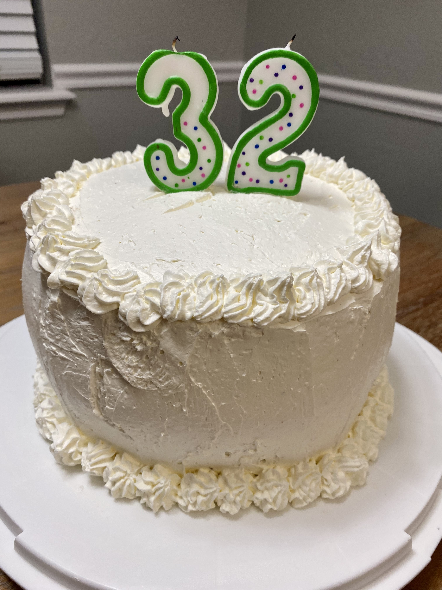

# Black Forest Cake

## Ingredients
- Dark Cherry Pie filling (at least 1 can)
- 1 slightly beaten egg
- 1 2/3 C granulated sugar
- 1 1/2 C milk
- 3 squares (3 oz) unsweetened chocolate, cut up
- 1 3/4 C all-purpose flour
- 1 t baking soda
- 1/2 C shortening
- 1 t vanilla
- 2 eggs
- 1/2 t salt
- 8 oz cream cheese
- 24 oz Cool Whip

## Steps
1. Grease and lightly flour two 9x1/2" baking rounds.
2. Combine beaten egg, 2/3 C sugar, 1/2 C milk, and chocolate.  Cook and stir till mixture just boils; Cool.
3. Combine flour, soda, and salt.
4. Beat shortening 30 seconds.  Add remaining  1 C sugar and vanilla; beat until fluffy.
5. Add eggs one at a time beating 2 minutes after each.
6. Add dry ingredients and remaining 1 C milk alternately to beaten mixture, beating after each addition.
7. Stir in chocolate mixture.
8. Divide into pans.
9. Bake @350ºF for 25-30 minutes.  Cool 10 minutes on racks before removing from pans.
10. Beat cream cheese and Cool Whip to make frosting.
11. To assemble layer cake, use frosting to create a ring for containing cherry filling.  Add top layer and frost.  Refrigerate.

## Notes
- For best results, make the day ahead of time and allow the cake to completely chill in the refrigerator.
