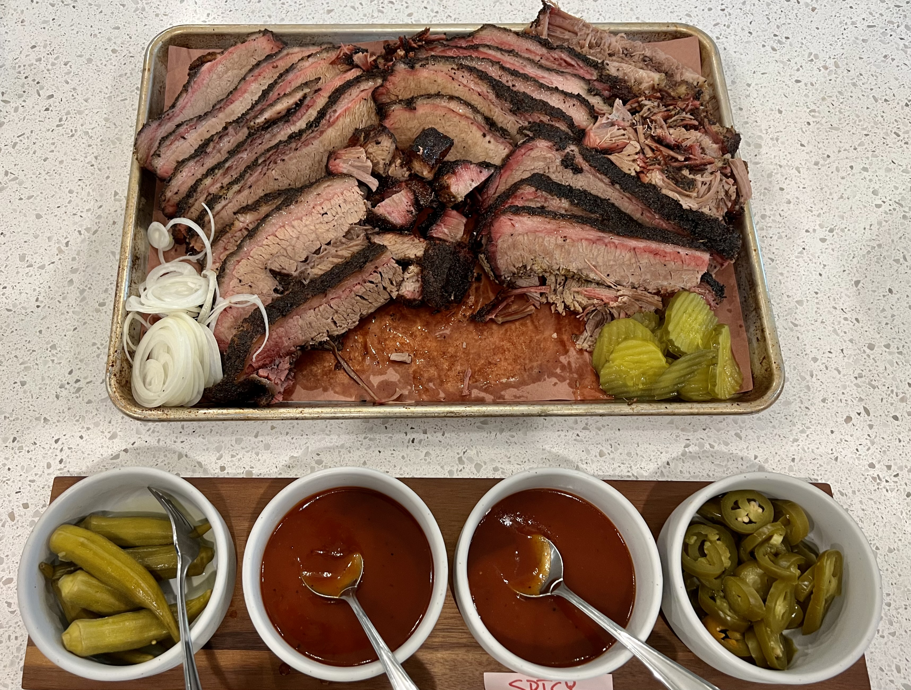

# Brisket

## Ingredients
- 1 full packer brisket
- Coarse Black Pepper
- Kosher Salt

## Videos
- Trim: <https://www.youtube.com/watch?v=MTc5VAgZKLE&t=1s>
- Cook: <https://www.youtube.com/watch?v=Mgy7ou8bFRQ>

## Steps
1. Trim Brisket. (Watch video for details)  Remove hard fat and loose pieces.  Square sides and remove rough meat.  Round corners and remove thin corners.  Shave fat side down to 1/4".  Reserve meat trim for grinding into burgers/sausage.  Reserve fat to render into tallow.

2. Mix pepper and salt in a ratio of 2/3 pepper to 1/3 salt.

3. Season all sides of the brisket liberally with salt and pepper mixture.  Start with meat side, then edges, and then finish with fat side.  Allow the seasoning to adhere for 20-30 minutes.

4. Prepare your smoker at a temp of 250ºF degrees. I like pecan wood, but post oak, mesquite, or hickory would also be good. We are looking for a heavy smoke wood on this cook. 

5. Place the brisket fat side up in the smoker.  Smoke until bark is dark and set.  The internal temperature should be around 165ºF to 170ºF.  This may take around 6 hours.

6. Wrap brisket in unwaxed butcher paper and return to smoker.

7. Smoke until probe tender (about 6 more hours). The internal temperature should be around 203ºF.

8. Remove from smoker and rest to an internal temp of 140ºF for slicing and serving.  Ideally, rest the brisket for at least 2 hours prior to serving.  The brisket can be wrapped in old towels and held in a dry cooler.

9.  Slice flat across the grain in slices about the size of a #2 pencil until your reach the point.  Then, rotate the point 90º and slice into thicker slices about the size of a jumbo pencil.

## Notes
Add trimmed fat chunks to a foil pan and smoke with the brisket.  The fat will render down into tallow.  Place a paper towel into a funnel and strain tallow into a mason jar for storing.  Add tallow to brisket when wrapping or save for later to cook with.