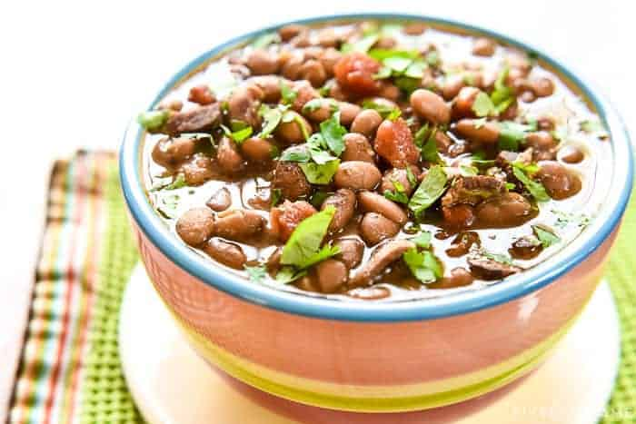

# Charro Beans

## Ingredients
- 1/2 pound bacon
- 1 pound dried pinto beans
- 4 cups water
- 2 cups beef broth
- 6 cloves garlic minced
- Fresh jalapeno diced
- 1 tablespoon cumin
- 1 teaspoon garlic powder
- 1 teaspoon chili powder
- 1 (10-ounce) can diced tomatoes & green chiles such as Rotel
- 1 cup fresh cilantro leaves chopped
- Salt & freshly ground black pepper
- 4 tablespoons butter

## Steps
1. Place the beans in a colander, rinse well, and remove any stones or shriveled beans.
2. Cook the bacon until just crispy. Drain, chop, and set aside.
3. Pour the beans into the slow cooker. Cover with water and beef broth. 
4. Add chopped bacon, garlic, jalapeño (if using), cumin, garlic powder, and chili powder. 
5. Cover and cook on low for 7 to 9 hours or until almost done. 
6. Stir in the Rotel and chopped cilantro; cover and cook for an additional hour or until tender (the total cooking time will likely be between 8 to 10 hours, depending on how hot your particular slow cooker runs). 
8. When the beans are done, season with salt and freshly ground pepper, to taste (stir in ½ teaspoon of salt at a time, tasting before adding more).
9. Stir in butter to taste.

## Notes
- Smash or blend some of the beans to add a creamy texture to the beans
- For Borracho Beans, swap out 6 ounces of the beef broth with Mexican beer
- Always use fresh dried beans, as old beans can take much longer to become tender (and may possibly never soften!)