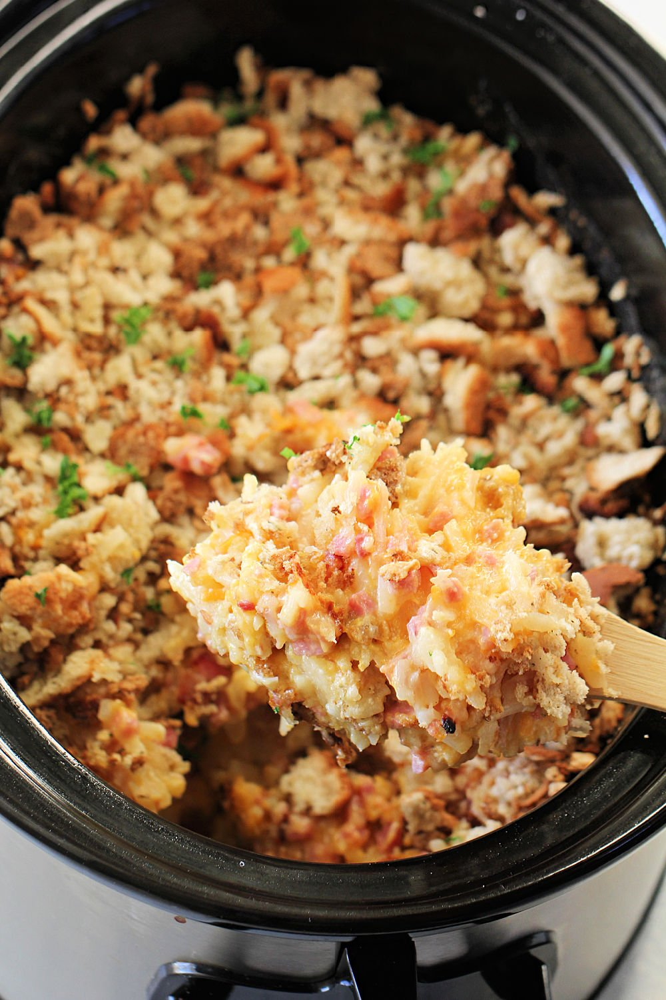

# Cheesy Potato Casserole

## Ingredients
- 32 ounce package frozen hash browns (with or without peppers) or cubed potatoes
- 10 oz can cream of chicken soup
- 8 oz sour cream
- 1 small onion
- 1/4 cup butter, plus
- 3 tablespoons butter, melted, divided
- 2 cups shredded cheddar cheese
- 1 1/2 - 2 cups herb seasoned stuffing mix
- season salt (to taste)

## Steps
1. Lightly butter the inside of your crockpot.
2. Combine soup, sour cream, onion, 1/4 c butter and seasonings in crock pot.
3. Add potatoes and cheese, mix well.
4. Cover mixture with dry stuffing mix and drizzle with the remaining 3 T of butter.
5. Cook on low for 4-6 hours or on high for 2 hours. Do NOT stir while cooking.

## Notes
- You can make a complete meal by adding cubed ham, frozen mixed veggies, and an extra can of soup.