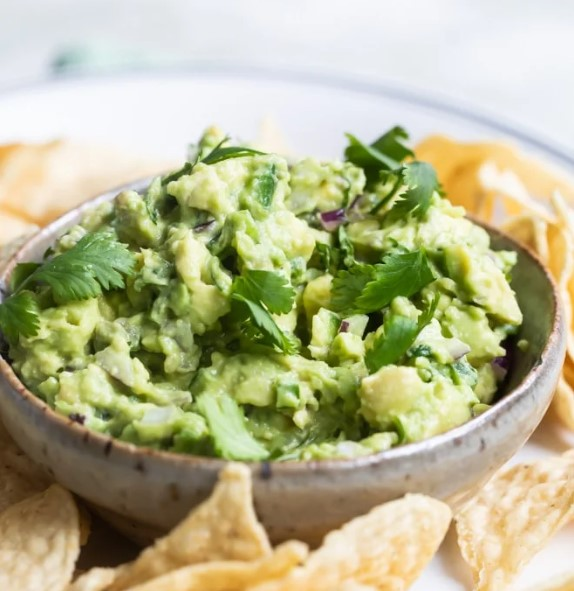

# Chipotle Guacamole

## Ingredients
- 6 large ripe avocados, peeled and pitted
- 1/4 cup citrus (lemon and lime) juice
- 3 cups fresh cilantro, chopped
- 1 1/2 cups red onion, finely chopped
- 12 large serrano chiles, seeded and finely chopped
- 1 1/2 teaspoons salt
- Tortilla chips, for serving

## Steps
1. Using a fork, mash avocados with citrus juice in a bowl.

2. Add cilantro, chopped onion, serrano chilies, and salt.  Stir to combine.

3. Serve with tortilla chips.

## Notes
- Serrano peppers can be partially or fully replaced with jalapenos.  Add peppers a little at a time to dial in the desired spice level.