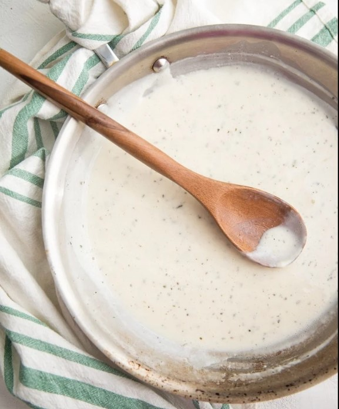

# Cottage Cheese Alfredo Sauce

## Ingredients
- 1 cup milk
- 1/2 cup cottage cheese
- 1T cornstarch
- 1/4 tsp salt
- 1/8 tsp pepper
- 3-5 fresh cloves of garlic
- 1/2 cup grated Parmesan cheese
- dried basil, to taste
- dried oregano, to taste
- fresh parsley, chopped (optional)
- 1/2 lb cooked pasta of choice

## Steps
1. Put all ingredients, except parsley, into a food processor or blender and blend until smooth.

2. Pour the mixture into a small saucepan.  Cook over medium-low heat until heated through and smooth.  Add more basil, oregano, salt, and pepper, to taste.

3. Cook for 5 minutes, stirring occasionally.  Add the cooked pasta right before serving and let soak in the sauce for a couple of minutes.  

4. Top with meat or veggies as desired.  Garnish with fresh chopped parsley.  Serve immediately.

## Notes