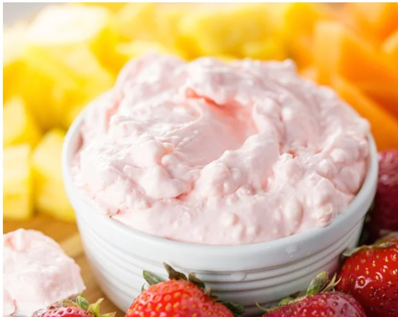

# Creamy Fruit Dip

## Ingredients
- 1 package Neufchatel cream cheese
- 1 small jar marshmallow cream

## Steps
1. Beat cream cheese util fluffy.

2. Mix in marshmallow cream until the dip is smooth.

## Notes
- Great with fruit of all kinds.  Also good on pumpkin bread.