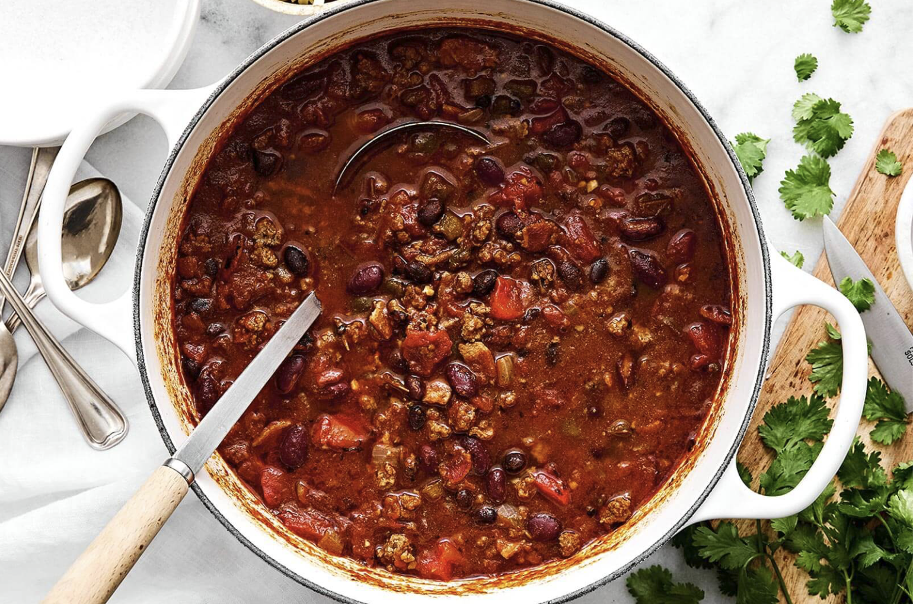

# Debdoozie's Blue Ribbon Chili

## Ingredients
- 2 pounds ground beef
- ½ medium onion, chopped
- 2 ½ cups tomato sauce
- 1 (15 ounce) can light red kidney beans
- 1 (15 ounce) can dark red kidney beans
- 1 (8 ounce) jar salsa
- 4 Tbsp chili seasoning mix
- 1 teaspoon ground black pepper
- ½ teaspoon garlic salt

## Steps
1. Place ground beef and onion into a large saucepan over medium heat. Cook and stir until beef is browned and crumbly and onion is translucent, about 10 minutes. Drain grease if desired.
2. Stir in tomato sauce, light and dark kidney beans, salsa, chili seasoning, pepper, and garlic salt until well combined.
3. Reduce the heat to low and simmer for at least 1 hour before serving.

## Notes
