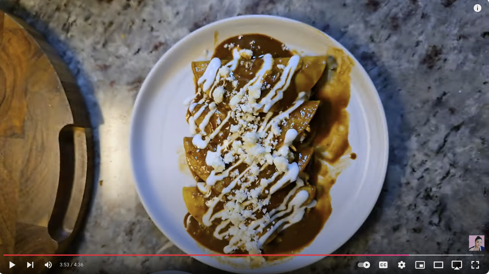

# Enmoladas (Chicken Enchiladas de Mole)

## Ingredients
- 1 1/2 boneless skinless chicken breasts
- 19.04 oz Doña Maria ready-made mole sauce
- 1 Tbsp chopped chipotle peppers in Adobo sauce
- 2 Tbsp peanut butter
- 1 oz Mexican hot chocolate
- 1 tsp chicken bouillon
- 1 1/2 tsp Salt Pepper Garlic (SPG)
- 1 tsp onion powder
- 12 corn tortillas
- *Garnishes: queso fresco, Mexican sour cream*

## Steps
1. **Prepare Chicken**: Season the chicken breasts with 1 tsp of SPG and 1 tsp onion powder. Place in a small crockpot.
2. **Add Mole Sauce**: Pour the mole sauce over the chicken. Add 1 tsp chicken bouillon, 1 Tbsp chopped chipotle peppers, 2 Tbsp peanut butter, and 1 oz Mexican chocolate.
3. **Cook Chicken**: Cover and cook on high for approximately 3 hours, or until the chicken is fully cooked and tender.
4. **Shred Chicken**: Once cooked, remove the chicken from the crockpot and shred it. Keep the mole sauce warm in the crockpot for assembling the enchiladas.
5. **Prepare Tortillas**: In a skillet, heat a small amount of oil over medium heat. Lightly fry each tortilla until warm and pliable, but not crispy.
6. **Assemble Enmoladas**: Carefully dip each tortilla into the warm mole sauce. Place it on a plate, fill with shredded chicken, and fold.
7. **Garnish**: Top with additional mole sauce, then garnish with crumbled queso fresco, a drizzle of Mexican sour cream, and, if desired, toasted sesame seeds or other toppings like lettuce, tomato, onion, or avocado.

## Notes
This recipe is a quick and flavorful way to enjoy traditional chicken enchiladas de mole. Adjust the mole sauce thickness with a bit of water if needed.
