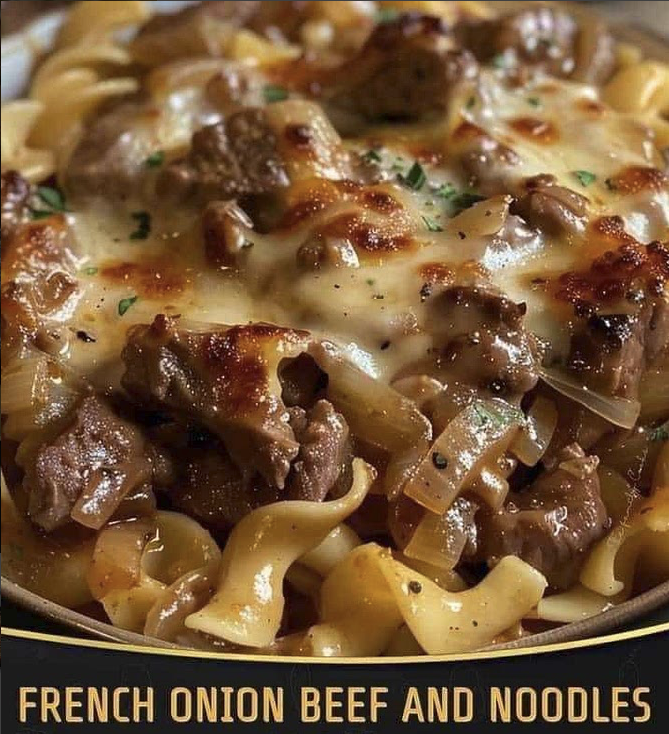

# French Onion Beef and Noodles (Pioneer Woman)

## Ingredients
- 2 tablespoons olive oil
- 1 pound beef stew meat
- 1 teaspoon onion powder
- 1 teaspoon garlic powder
- Salt, to taste
- Pepper, to taste
- 1 (10.5-ounce) can French Onion Soup
- 3 cups beef broth
- 12 ounces egg noodles
- 1/2 cup sour cream
- 1/4 cup Parmesan cheese
- 1 cup French fried onions

## Steps
1. **Heat the Oil**: In a large pot, heat olive oil over medium-high heat.
2. **Sear the Beef**: Add beef stew meat and season with onion powder, garlic powder, salt, and pepper. Sauté for 3-5 minutes until beef is seared on all sides.
3. **Simmer with Soup and Broth**: Pour in the French onion soup and beef broth. Bring to a simmer, then let the beef cook on low for 10 minutes.
4. **Cook the Noodles**: Add egg noodles to the pot and continue to simmer for an additional 10 minutes, stirring occasionally, until noodles are tender.
5. **Add Dairy**: Remove the pot from heat. Stir in sour cream and Parmesan cheese until well combined.
6. **Serve**: Sprinkle with French fried onions before serving.