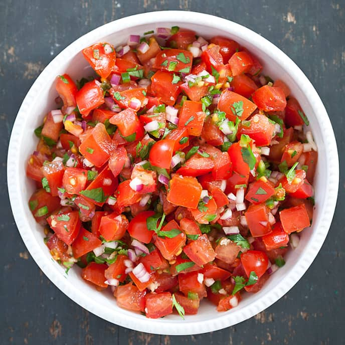

# Fresh Tomato Salsa (America's Test Kitchen)

## Ingredients
- 1 ½ lbs firm ripe tomatoes, diced (about 3 cups)
- 1 large jalapeno chili, seeded, with the flesh minced (about 2 Tbs or to taste). Note: For hotter salsa, mince the seeds separately and add to desired
- ½ cup minced red onion
- 1 small clove garlic, minced (½ tsp)
- ¼ cup chopped fresh cilantro leaves
- ½ tsp salt
- pinch ground pepper
- 2-6 tsp lime juice (1-2 limes)
- Sugar to taste (up to 1 tsp)

## Steps
1. Place tomatoes in colander and let drain 30 minutes. 
2. As they drain, layer jalapeno, onion, garlic and cilantro on top. Shake colander to drain off excess juice. Discard. 
3. Transfer to large bowl and add salt, pepper and 2 tsp lime juice. Toss to combine. Taste and add minced jalapeno seeds, sugar and lime juice to taste.

## Notes
- This salsa can be made 2-3 hours in advance, but hold off adding the salt, lime juice and sugar until just before serving.
