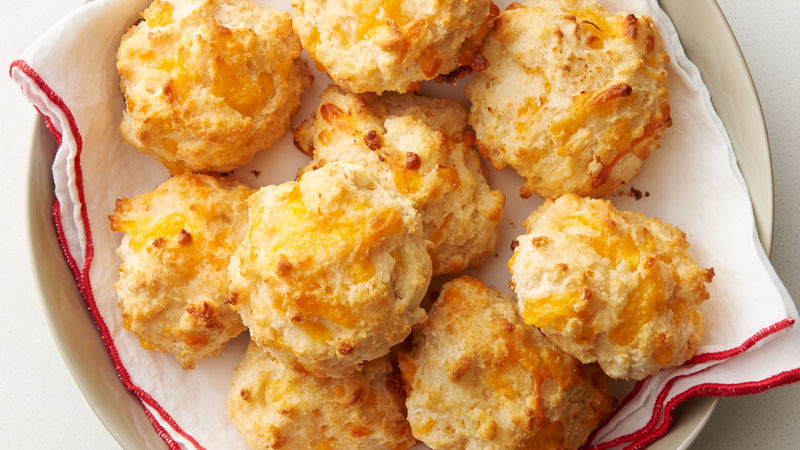

# Garlic Cheese Biscuits

## Ingredients
- 2 cups Bisquick
- 2/3 cup buttermilk
- 1/2 cup grated cheddar cheese
- 1/4 cup margarine
- 1/2 t garlic powder

## Steps
1. Mix Bisquick, buttermilk, and cheddar and then drop spoonfuls onto an ungreased cookie sheet.

2. Bake at 400ºF for 8-10 minutes or until golden

3. Add garlic powder to melted margarine and spoon over biscuits while still hot on the pan.

## Notes
- If you don't have buttermilk, you can add 1 T vinegar or lemon juice to milk to make some.