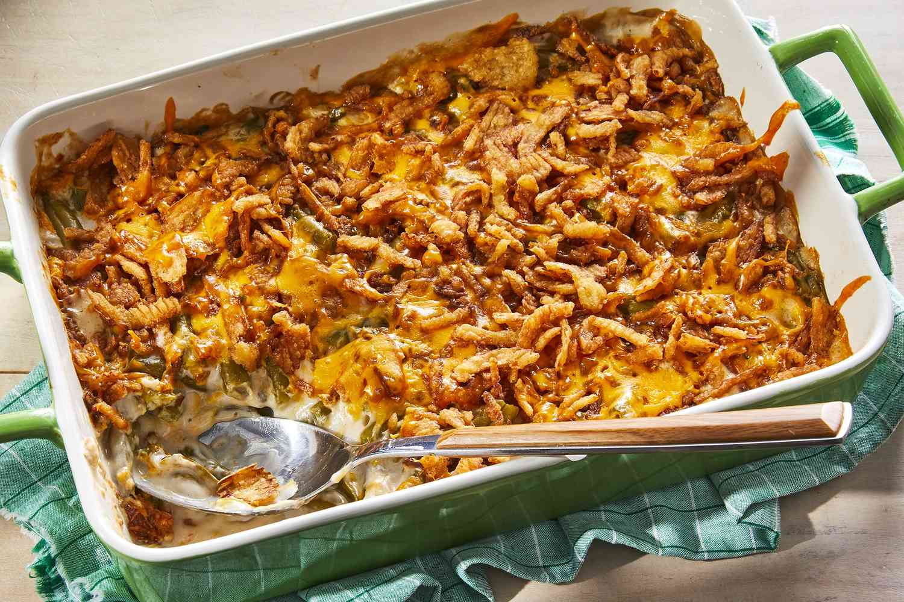

# Green Bean Casserole

## Ingredients
- 2 cans French green beans
- 1 can French fried onions
- 1 can cream of mushroom soup
- Black pepper to taste

## Steps
1. Mix green beans, 1/2 of the can of onions, soup and pepper
2. Put in casserole dish and bake at 350ºF until bubbly (about 30 minutes)
3. Sprinkle the rest of the onions on top of the casserole and put back in the oven for 5 minutes to brown.

## Notes
- This casserole can be made ahead of time and kept in the refrigerator before baking.