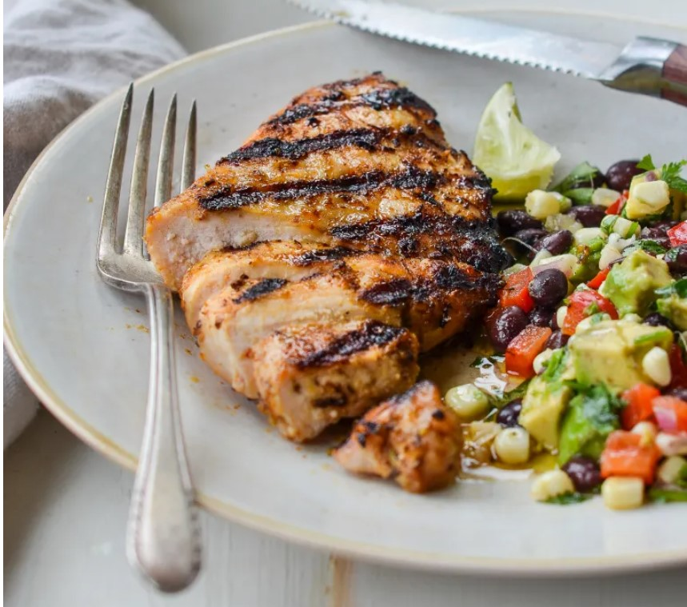

# Grilled Tequila Lime Chicken

## Ingredients
- 3 tablespoons olive oil
- 3 tablespoons tequila
- 1 tablespoon lime zest, from about 2 limes
- 4 cloves garlic, minced
- 1 1/4 teaspoons ground ancho chili pepper
- 1/2 teaspoon ground coriander
- 1/4 teaspoon dried oregano
- 1 1/4 teaspoons salt
- 1/2 teaspoon freshly ground black pepper
- 2 teaspoons honey
- 4 boneless skinless chicken breasts (or about 2 pounds), pounded to an even 1/2-inch thickness.  Butterfly extra thick breasts.
- 1 lime, sliced into wedges, for serving (optional)

## Steps
1. Combine all of the ingredients except for the chicken breasts in a 1-gallon freezer bag. Close the bag and squish the marinade around to mix.

2. Add the chicken breasts and massage the marinade into the meat until evenly coated. Seal the bag and place it in a bowl in the refrigerator (the bowl protects against leakage); marinate for at least 2-4 hours or overnight.

3. Clean the grill and preheat to high. Lightly dip a wad of paper towels in vegetable oil and, using tongs, carefully rub over the grates several times until glossy and coated. (Alternatively, you can spray the grates with a non-flammable cooking spray.) 

4. Place the chicken breasts on the grill and spoon any remaining marinade from the bag over top. Grill, covered, for 2 to 3 minutes per side (turning only once) or until internal temperature reaches 165ºF.

5. Serve immediately with lime wedges.

## Notes
