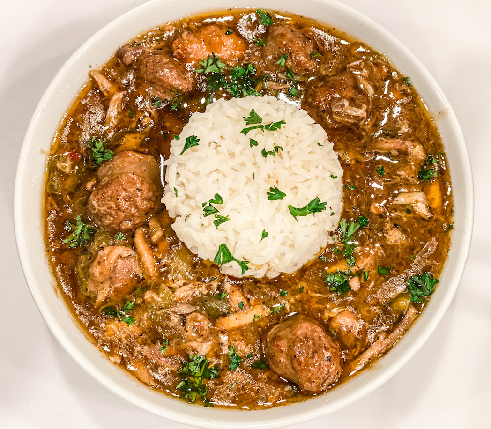

# Gumbo

## Gumbo Ingredients
- 2 cups cooked chicken (See "Chicken")
- 7 cups chicken stock (if cooking whole chicken, will only need 2-3 cups extra stock)
- 1 lb sausage, cut into slices
- 2 teaspoons salt
- 1/2 teaspoon pepper
- 1/4 teaspoon cayenne pepper

## Roux
- 2/3 cup oil
- 2/3 cup flour
- 2 cups onion, chopped
- 1 cup celery, chopped
- 1/2 cup green bell pepper, chopped
- 4 cloves garlic, minced
- 1/4 cup parsley, chopped
- 1/4 cup green onion tops, chopped

## Chicken
- 1 whole chicken
- 1/2 onion (See "cooking chicken")
- 1 rib celery (See "cooking chicken")
- 1 teaspoon salt (See "cooking chicken")
- 1/2 teaspoon cayenne pepper (See "cooking chicken")
- 1/4 cup white wine (See "cooking chicken")

## Steps
1. Cut the chicken into pieces and place in a dutch oven.  Add the onion, celery, wine, and seasonings.  Fill with water until just covering the chicken.  Bring to a boil and then simmer until the chicken is fully cooked (30-40 minutes depending on the size of the chicken).  Remove chicken and let cool.  Remove chicken skin and discard.  Pull chicken meat.  Filter stock through paper towels and reserve.

2. Roux.  Mix oil and flour together in a 4-cup measureing cup.  Microwave uncovered on HIGH for 6 minutes.  Stir.  Roux will be a ilght brown and will need to cook in increments of 30 seconds to reach a dark brown color (30 seconds to 2 minutes more).  Be careful not to burn the roux, but try and make it as dark as possible.

3. Add onion, celery, and bell pepper to roux in the measureing cup.  Add slowly because the roux is very hot and will pop and splatter.  Stir.  Microwave on HIGH for 3 minutes.

4. Add garlic, parsley, and green onion to roux.  Stir.  Microwave on HIGH for 2 minutes.  You should haev about 3-3/4 cups of roux now.  If any oil has risen to the top, pour this off.

5. Slowly add enough hot tap water to bring roux to the 4-cup mark.  Stir.

6. Place Roux in 5 quart dutch oven.  Stir in 7 cups chicken stock and gumbo seasonings.  Cover and bring to gentle simmer for 5 minutes.

7. Add chicken and sausage.  Simmer an additional 10 minutes (or as long as desired).  Taste for salt.

8. Serve over white rice.

## Notes
1. Roux freezes very well