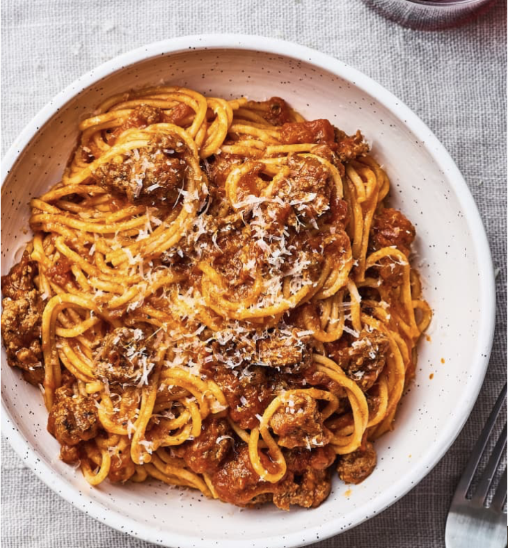

# Instant Pot Spaghetti

## Ingredients
- 1 tablespoon olive oil
- 1 pound ground beef
- 1 teaspoon kosher salt
- 1 teaspoon onion powder
- 1/2 teaspoon garlic powder
- 2 cups water, divided
- 1 (24-ounce) jar marinara or tomato-based pasta sauce
- 8 ounces dry spaghetti
- Grated Parmesan cheese, for serving

## Steps
1. **Sauté the Beef**: Turn an electric pressure cooker on to sauté. Once heated, add the olive oil and beef. Break the beef up into large pieces and season with salt, onion powder, and garlic powder. Cook, stirring and breaking the beef into smaller pieces, until cooked through and no longer pink, about 5 minutes.
2. **Add 1/2 Cup Water and Sauce**: Turn off the sauté function and add 1/2 cup of water to the pot, scraping the bottom to remove any stuck-on bits. Add the sauce and stir to combine well.
3. **Layer Spaghetti**: Break the spaghetti strands in half and spread them in one or two layers over the ground beef mixture. Do not stir from this point on.
4. **Add Remaining Water Without Stirring**: Rinse the pasta sauce jar with the remaining 1 1/2 cups water and pour over the pasta. Remember — no stirring here.
5. **Set to HIGH for 8 Minutes**: Seal the pressure cooker and set to cook on HIGH pressure for 8 minutes. The cooker should take 10-12 minutes to come up to pressure.
6. **Quick Release and Stir**: Open the pressure release valve (quick release) as soon as the cook time ends. Open the pressure cooker, stir the spaghetti into the sauce, and turn off the pressure cooker. Remove the insert from the pressure cooker and serve immediately with grated Parmesan cheese.

## Notes
- Serve with additional Parmesan cheese if desired.
