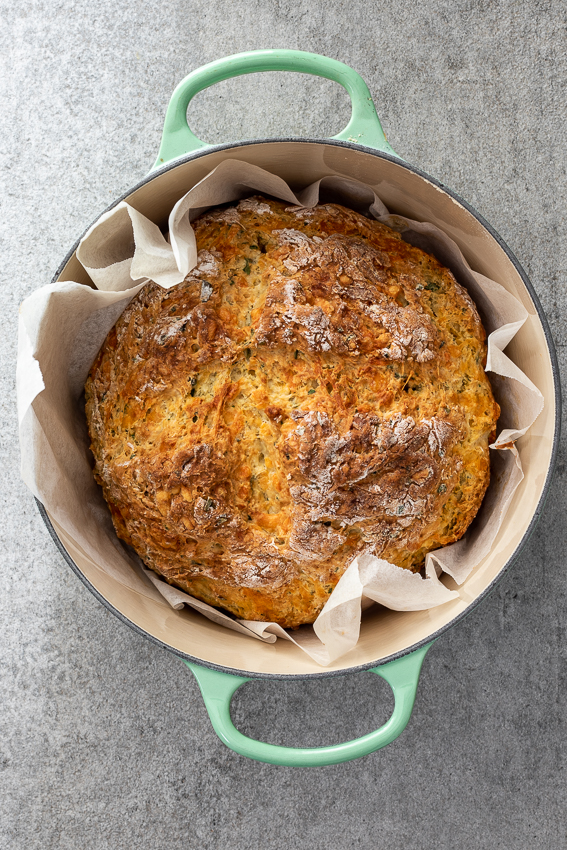

# Cheese and Herb Irish Soda Bread

## Ingredients
- 4 cups flour
- 1 1/2 tsp baking soda
- 1 t salt
- 2 cups buttermilk
- 1 egg
- 1 cup grated cheddar cheese
- 1/2 cup fresh herbs, chopped (or equivalent of dried) _(I like Trader Joes Italian Style Soffritto - crispy onions, sun-dried tomatoes, sea salt, garlic, red peppers, parsley, rosemary, sage)_

## Steps
1. Pre-heat the oven to 360ºF and line a Dutch oven/cast iron pot with baking/parchment paper.

2. In a large mixing bowl, whisk together the dry ingredients. 

3. Whisk an egg into the buttermilk and pour into the dry ingredients. 

4. Mix the dough until it just starts to come together (there will be large lumps) then add the cheese and herbs. 

5. Continue mixing until the dough just comes together. The dough will be sticky and shaggy looking (not too smooth or else it will be over-mixed). 

6. Transfer to the prepared pot then score a cross onto the top with a sharp knife. Cover with the lid and place in the pre-heated oven. 

7. Bake for 30-45 minutes or until the bread is cooked through. It will sound hollow when knocked on the bottom and a skewers inserted will come out clean. 

8. Remove from the oven and allow to cool for 10-15 minutes before slicing and serving with butter. 

## Notes