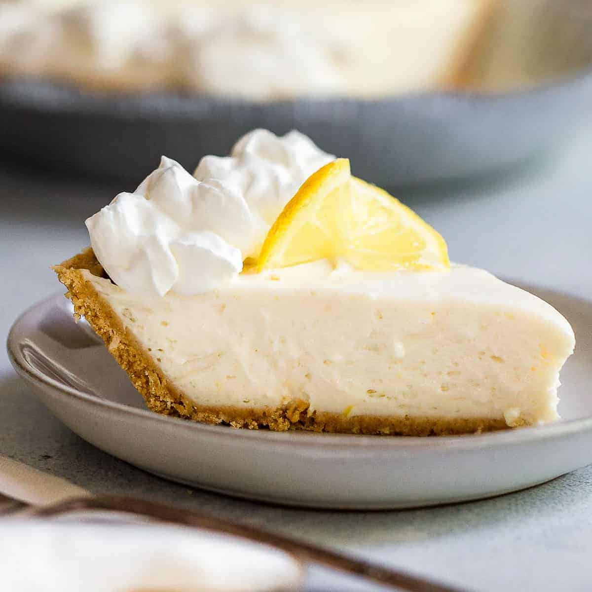

# Lemon Icebox Pie

## Ingredients
- 1 can Eagle Brand milk (sweetened condensed milk)
- 6 oz Cool Whip
- 1/2 cup lemon juice
- 1 graham cracker pie crust

## Steps
1. Mix ingredients together until smooth and pur into graham cracker crust.
2. Refrigerate for 2-4 hours or until firm.

## Notes