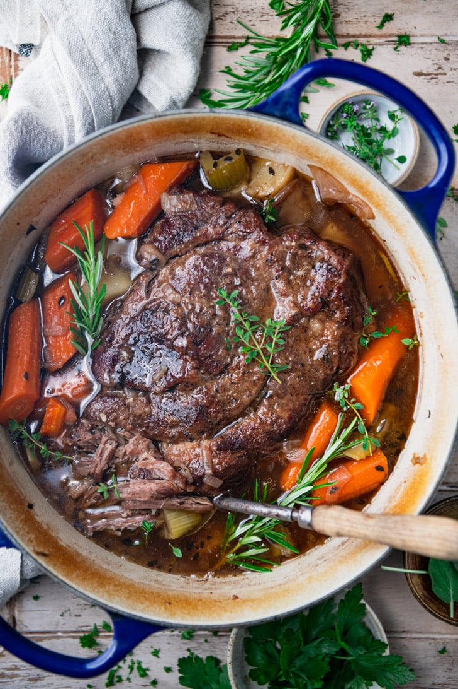

# Memaw's Roast

## Ingredients
- 1 chuck roast
- 1 Packet Lipton Recipe Secrets (Onion Flavor)
- Cooking spray
- Carrots
- Cornstarch Slurry
- Kitchen Bouquet (Browning & Seasoning Sauce)
- Beef Bouillon

## Steps
1. Pre-heat the oven to 300ºF.  Spray dutch oven with cooking spray.
2. Sear roast on the stove.
3. Add Lipton packet and carrots.
4. Cook roast and carrots in oven for 3.5 hours.
5. Make gravy with cornstarch slurry, kitchen bouquet, and beef bouillon.

## Notes
