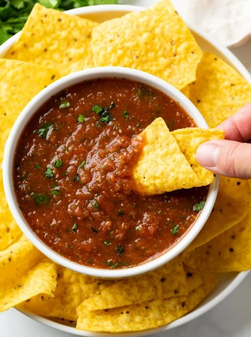

# Myles's Medium Salsa

## Ingredients
- 3-roma tomatoes
- 1/2-small jalapeno
- 1/4-small white onion
- 1T-fresh cilantro leaves
- juice from 1/2 lime
- 1t salt
- 1/4 bell pepper[red,yellow,or orange]

## Steps
1. rough chop veggies and add to blender bowl
2. squeeze the lime into blender bowl
3. add salt
4. blend until mixed
5. serve with sea salt tortilla chips

## Notes  
once upon a time my wife tracy and I went to visit my grandchildren. we went to the store and got peppers and herbs. So we made salsa it was a little spicy but my older grandchild could take it. He said it "wasn't spicy" but I knew he thought it was spicy. the end. p.s. it is called the m.m.s for short.