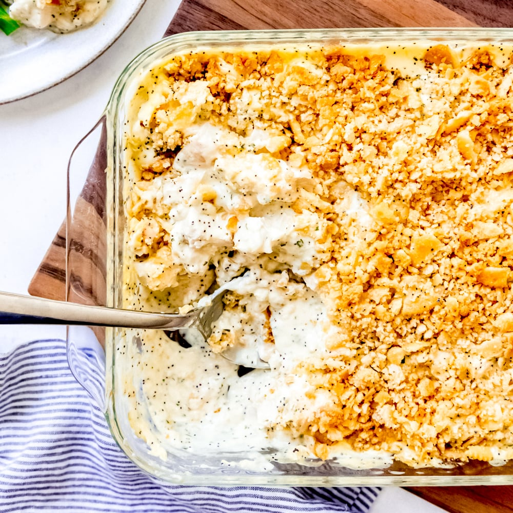

# Poppy Seed Chicken

## Ingredients
- 4-5 chicken breasts
- 1 can cream of chicken soup
- 8 oz. sour cream
- 1 stick butter/margarine, melted
- Poppy seed

## Steps
1. Cook chicken (baked or grilled is best, but can also be boiled).
2. Cut chicken into cubes and lay in baking dish.
3. Mix soup and sour cream and spread over chicken.
4. Crumble Ritz crackers and mix with melted butter.
5. Press Ritz mixture on top of chicken and soup mixture.
6. Sprinkle poppy seed on top to taste.
7. Bake at 350ºF until bubbly (about 25-30 minutes)

## Notes