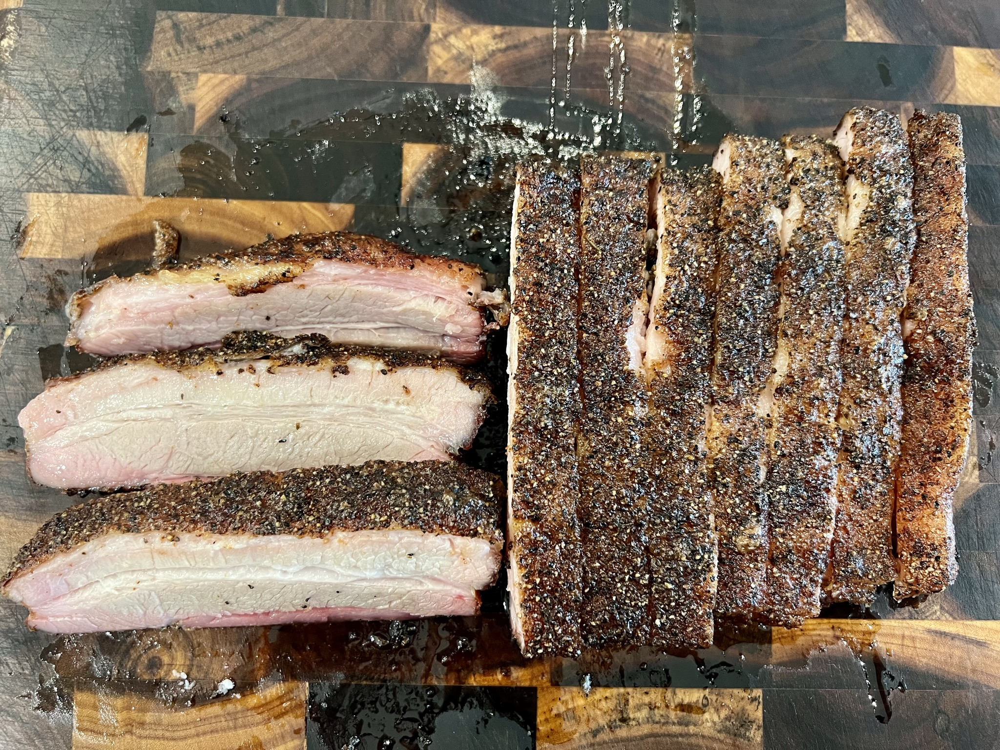

# Pork Belly Brisket

## Ingredients
- 1 skinless pork belly
- BBQ rub

## Steps
1. Prepare your smoker at a temp of 275ºF degrees. I like pecan wood, but post oak, mesquite, or hickory would also be good. We are looking for a heavy smoke wood on this cook since we are cooking this like a brisket.

2. Cut the belly into 4 sections. Trim them as evenly as possible removing any ridges that are too tall or too thin.

3. Season all sides liberally with BBQ rub.  Allow the seasoning to adhere for 15 minutes 

4. Place the pork belly fat side up in the smoker.  Smoke until probe tender (about 4 to 5 hours) The internal temperature should be around 200ºF to 210ºF.

5. Remove from smoker and rest for at least 15 minutes.  

6. Use a sharp knife and slice like a brisket.

## Notes
Leftover pork belly reheats well in the air fryer or the skillet.  Pair with corn tortillas for excellent tacos.