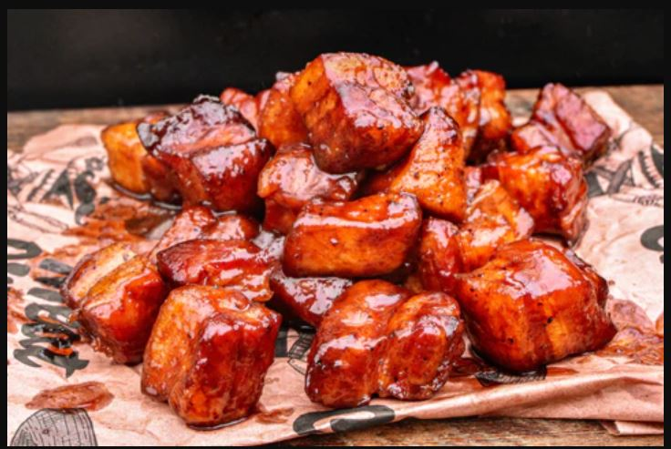

# Pork Belly Burnt Ends

## Ingredients
- 1 skinless pork belly
- BBQ rub
- BBQ Sauce
- Honey (optional)
- Brown Sugar (optional)
- Hot Sauce/Jalepenos (optional)

## Steps
1. Prepare your smoker at a temp of 275 degrees. I like pecan wood, but post oak, mesquite, or hickory would also be good.

2. Cut the belly into 1" x 1" cubes.

3. Season all sides liberally with BBQ rub.  Allow the seasoning to adhere for 15 minutes.

4. Place the pork belly fat side up on a wire baking rack in the smoker.  Smoke until probe tender (about 3 hours). The internal temperature should be around 195ºF to 200ºF.

5. Remove from smoker and toss with BBQ sauce in a foil pan.  Add optinal ingredients such as honey, brown sugar, or hot sauce as desired.  The pieces should be fully coated, but not swimming in sauce.  

6. Return to smoker and cook for an additional 45 to 60 minutes so the sauce can reduce and tack up.

7. Remove from smoker and rest for at least 15 minutes.

## Notes