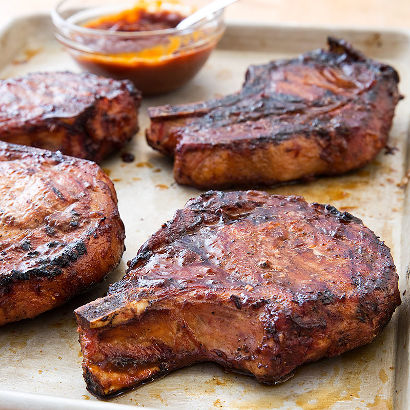

# Pork Chops

## Ingredients
- Thick Cut, Bone-In Pork Chops
- Coarse Black Pepper
- Kosher Salt
- Garlic Powder

## Steps
1. Dry brine - season pork chops liberally with kosher salt and place on a wire rack over a sheet tray in the refrigerator.  Let them dry brine for at least 2 hours, but 8 to 12 hours is preferred.

2. After dry brining, season with coarse pepper and garlic powder on all sides.

3. Smoke at 225F until the internal temperature reaches 120-125F.

4. Remove chops and heat grill to 650-700F.

5. Grill chops to add color and finish cooking to internal temperature of 130-140F.

## Notes