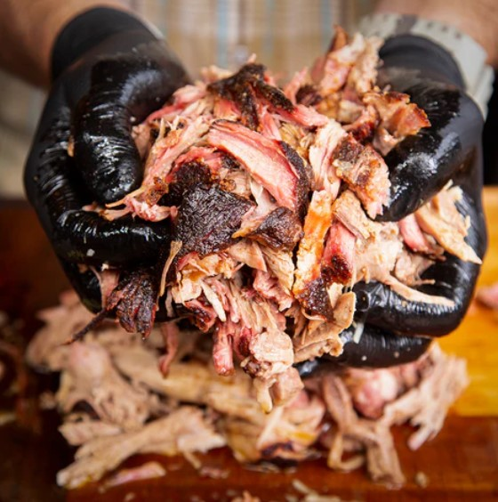

# Pulled Pork

## Ingredients
- 8-10 lbs pork shoulder (a.k.a pork butt)
- BBQ rub
- yellow mustard

## Steps
1. Prepare your smoker at a temp of 275 degrees. I like pecan wood.

2. Trim excess fat from the pork shoulder.  Cut a shallow cross hatch pattern through the fat cap.

3. Slather all over with mustard.  Season all sides liberally with BBQ rub.  Allow the seasoning to adhere for 15 minutes 

4. Place the pork shoulder fat side down in the smoker.  Smoke until the internal temperature is around 165ºF (about 6 hours).

5. Remove from smoker, place in foil pan, and add butter and extra rub.  Cover with foil.

6. Return pan to smoker and cook until the pork shoulder reaches an internal temperature of 205ºF and is probe tender.

7. Allow the pork to rest and then shred.  Add additional seasoning to pulled pork as desired.

## Notes
- The time required can vary from shoulder to shoulder.  Estimate at least 1 hour per pound of meat.  Start early enough to give a couple of hours of margin before the desired eating time.
- To hold the shoulder after cooking, wrap the foil pan in old towels and place in a dry cooler to keep the pork warm for several hours until ready to serve.
- Wait to pull the pork until just ready to serve to preserve the heat and juices.