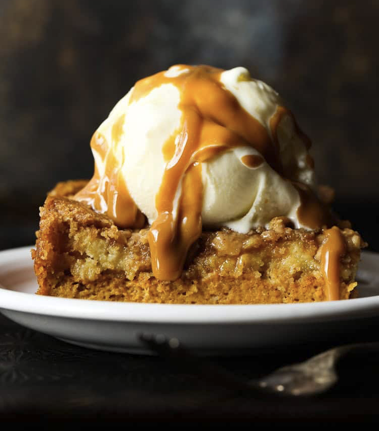

# Pumpkin Dump Cake

## Ingredients
- 1 (15-ounce) can pure pumpkin
- 1 (10-ounce) can evaporated milk
- 1 cup light brown sugar
- 3 eggs
- 3 teaspoons pumpkin pie spice
- 1 box yellow cake mix
- 1 cup (2 sticks) butter, melted
- 1 cup coarsely crushed graham crackers or pecans
- 1/2 cup toffee bits (optional)

## Steps
1. **Preheat Oven**: Preheat oven to 350°F. Coat a 9×13-inch baking pan with nonstick spray and set aside.
2. **Mix Filling**: In a large bowl, combine the pumpkin, evaporated milk, brown sugar, eggs, and pumpkin pie spice. Stir to combine, then pour into the prepared pan.
3. **Add Toppings**: Sprinkle the entire box of cake mix on top, followed by the crushed graham crackers or pecans, and optional toffee bits.
4. **Add Butter**: Pour the melted butter evenly over the top of the cake mix and toppings.
5. **Bake**: Bake for 45-50 minutes, until the center is set and the edges are lightly browned.
6. **Serve**: Serve warm or at room temperature.

## Notes
- Serve with ice cream or whipped cream for extra indulgence.
- Store leftovers in an airtight container in the refrigerator