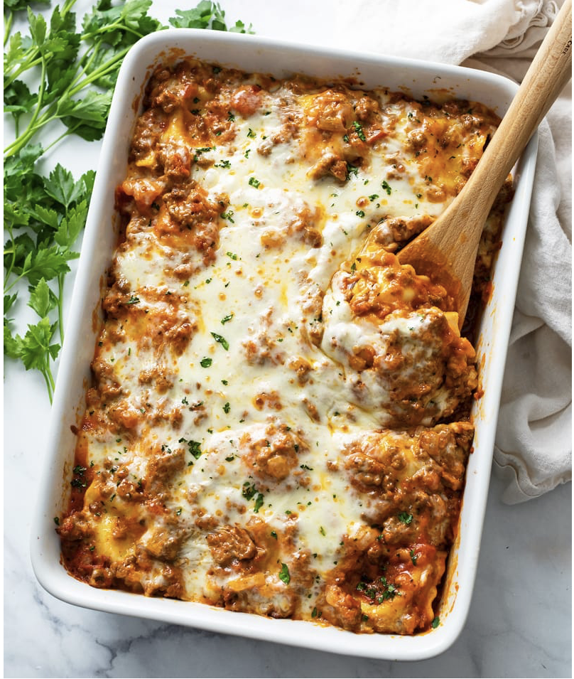

# Ravioli Casserole

## Ingredients
- 1 package (20 ounces) refrigerated cheese ravioli (can also cook from frozen)
- 3-1/2 cups pasta sauce
- 2 cups small-curd 4% cottage cheese
- 4 cups shredded mozzarella cheese
- 1/4 cup grated Parmesan cheese
- Minced fresh parsley (optional)

## Steps
1. **Preheat Oven**: Preheat the oven to 350°F 
2. **Layer Ingredients**: Spread 1 cup of pasta sauce in an ungreased 13x9-inch baking dish. Layer with half the ravioli, 1-1/4 cups pasta sauce, 1 cup cottage cheese, and 2 cups mozzarella cheese. Repeat the layers.
3. **Top with Cheese**: Sprinkle with grated Parmesan cheese.
4. **Bake**: Bake, uncovered, for 30 to 40 minutes, or until bubbly. Let stand for 5 to 10 minutes before serving.
5. **Garnish**: If desired, sprinkle with minced fresh parsley before serving.

## Notes
This dish is a family favorite, offering all the flavors of lasagna without the hassle. It's quick to assemble, making it perfect for busy weeknights.
