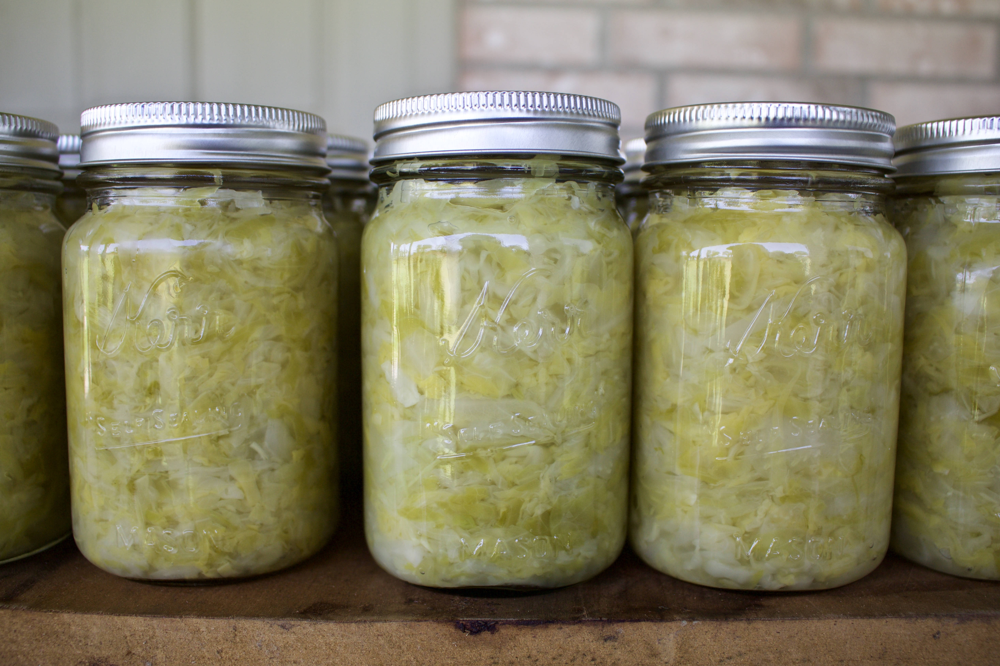

# Sauerkraut

## Ingredients
- 20 heads cabbage
- Morton's table salt
- Water

## Tools
- Cabbage shredder
- Large crock
- Large tub
- 13 gallon trash bag (unscented)
- About 22 pint sized canning jars

## Steps
1. Scrub crock, tub, and shredder with dish detergent soap to clean and sterilize
2. Wash cabbage in a tub with garden hose
3. Shred cabbage into crock
4. Every 3-4 heads, pack shredded cabbage down with fist and sprinkle liberally with salt
5. Repeat shredding, packing, and salting until the crock is 3-4" from being full.
6. Fill a kitchen trash bag partially with water, and place on top of crock to weight down & seal crock
7. Store sealed crock on the porch
8. Every few days, remove water from bag since cabbage will swell
9. After 14 days, bring sauerkraut to a boil
10. Pack into clean canning jars

## Notes
