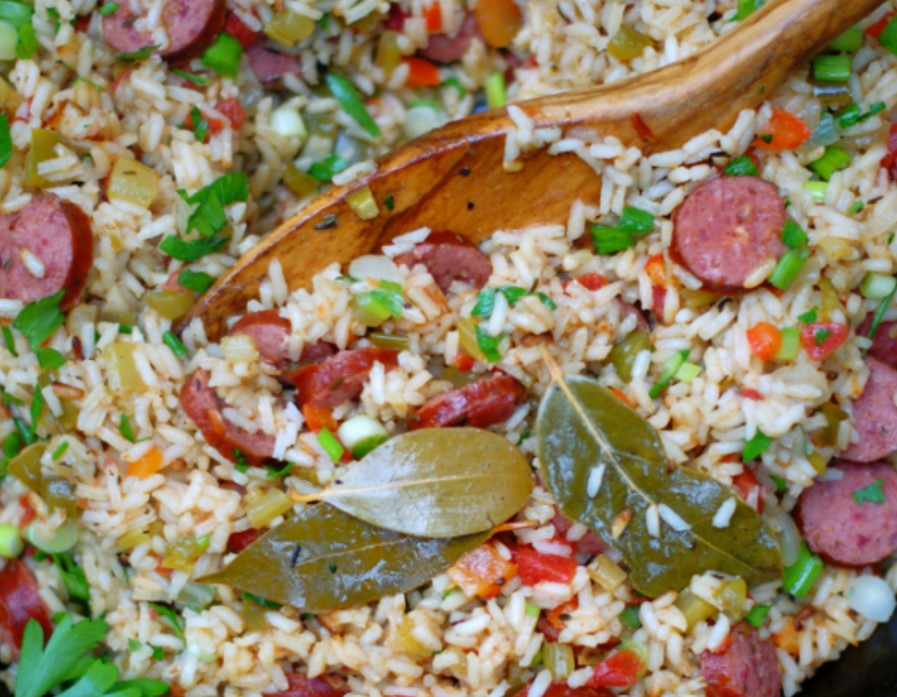

# Sausaage Jambalaya

## Ingredients
- 1.5 teaspoons minced garlic
- 1 cup diced yellow onion
- 1 cup diced green bell pepper
- 1 cup diced celery
- 1 pound smoked sausage (beef or pork), sliced into half moons
- 14.5 ounces can of diced tomatoes
- 3 cup chicken broth (or chicken stock)
- 2 teaspoons Tony Chachere's seasoning
- 2 bay leaves
- ½ teaspoon dried thyme
- ½ teaspoon dried oregano
- ¼ teaspoon cayenne pepper
- 2 cup long grain rice
- 4-5 green onions, chopped
- 2 tablespoons chopped fresh parsley

## Steps
1. Brown sausage in a dutch oven over medium-high heat until browned and some fat has rendered.

2. Add garlic. Stir while garlic lightly browns. Add onions, bell pepper and celery. Sautee until softened but not quite translucent. 

3. Add in canned tomatoes and broth. Stir to remove any browned bits of sausage from the bottom of the skillet. Stir in dried herbs and spices. Let come to a low boil. 

4. Add rice and stir to incorporate. 

5. Turn heat down to low, cover and let cook for 25-35 minutes or until rice is fluffy. Stir occasionally to make sure rice does not stick. There should be little no liquid left.

6. Remove from heat. Stir in chopped green onions and parsley and serve.

## Notes