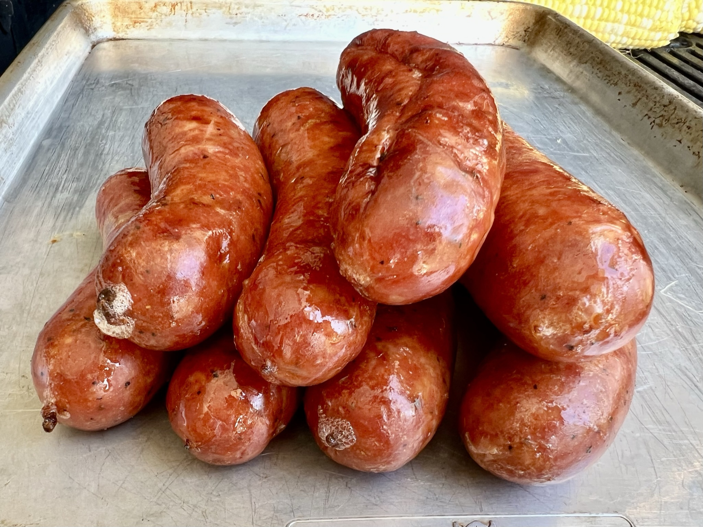

# Sausage

## Ingredients
- 80/20 or 70/30 Meat to Fat ratio (Ground Pork Shoulder and Ground Brisket Trim is ideal)
- Natural hog casings (32-38mm), rinsed and soaked overnight 
- Salt
- Pink Salt (Prauge Powder #1)
- High Temp Milk Powder
- Granulated Garlic
- Mustard Powder
- Coarse Black Pepper
- Paprika
- Cayenne Pepper

## Master Spice Ratio
All measurements are given as a percentage of overall meat and fat weight.  For spices, primary flavors are 0.50%, secondary flavors are 0.25%, and background flavors are 0.125%.  The flavoring of the sausage can be modified by substituting different spices using these ratios.  If mixing in salty ingredients such as cheese, consider reducing the salt percentage to 1.50%.

Use this [Recipe Calculator](https://docs.google.com/spreadsheets/d/1vD5hAmGH3YizIl4AM9kqCLZv0eMIJKG2SCakTLYtG7I/edit#gid=0) to calculate the amount of spices for the given meat weight.

| Percentage  | Ingredient     |
| ----------- | -------------- |
|  2.00%      | Salt           |
|  0.25%      | Pink Salt      |
|  4.00%      | Milk Powder    |
| 10.00%      | Water          |
|  0.50%      | Garlic Powder  |
|  0.50%      | Mustard Powder |
|  0.25%      | Pepper         |
|  0.25%      | Paprika        |
|  0.125%     | Cayenne        |

## Steps (Day 1)
1. Cut meat and fat into 1/2" to 1" cubes.

2. Place in 1 layer on a try and freeze for 30 minutes to aid with a clean grind.

3. Grind using a coarse grider plate.

4. Mix ground meat with spices and water until very sticky. 3-5 minutes using a Kitchen-Aid with paddle attachment.  The meat should stick to the underside of an outstretched hand.

5. Stuff into casings.  Twist into links but do not cut yet.

6. Refrigerate sausages on a wire rack in the refrigerator overnight.

## Steps (Day 2)
1. Sausages should be dried out.  If not, dry them with a fan for 30 minutes.

2. Cut into separate links.  Each link will stay together now that the casings are dry.

3. Smoke at 150ºF for 3-4 hours.  I like pecan wood.

4. Shock sausages in an ice bath for 5 minutes.

5. Reheat at 300ºF for approximately 20-30 minutes until heated though.  Sausages should be plump and slightly glistening with fat.

## Notes
- Smoked sausages can be vacuum sealed and frozen for later.