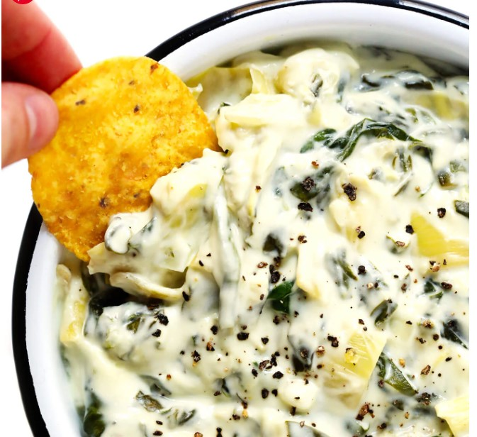

# Slow Cooker Spinach Artichoke Dip

## Ingredients
- 1 (10-ounce) bag fresh baby spinach, roughly chopped
- 1 (13-ounce) can quartered artichoke hearts, chopped and drained
- 1 (8-ounce) brick low-fat cream cheese, cut into 1-inch cubes
- 1 cup light sour cream or plain Greek yogurt
- 1 cup shredded Mozzarella cheese
- 1/2 cup grated Parmesan cheese
- 1/3 cup finely-chopped white or red onion
- 4 cloves garlic, minced
- 1/2 teaspoon black pepper
- 1/4 teaspoon fine sea salt

## Steps
1. **Combine all ingredients.**  Add all of the ingredients to the bowl of a small slow-cooker and toss briefly to combine.

2. **Slow cook.**  Cover and cook* on low for 2-3 hours ***or*** on high for 1 hour, until the cheese is completely melted.

3. **Stir and season.**  Stir the dip until evenly combined.  Taste and season with salt and pepper as needed.

4. **Serve.**  Serve warm, accompanied with whatever dippers you prefer

## Notes