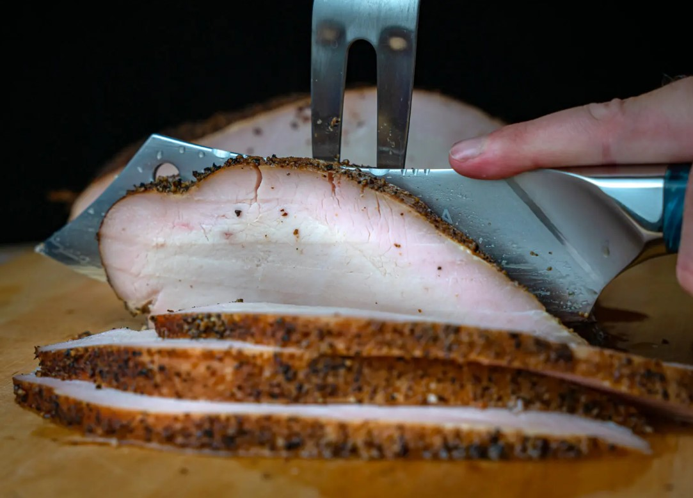

# Smoked Turkey Breast

## Ingredients
- Boneless, skinless turkey breasts (Sometimes called turkey tenderloin)
- Mayonnaise
- BBQ Rub
- Butter

## Steps
1. Trim excess fat/skin from turkey breast.

2. Slather with a thin coat of mayonnaise

3. Season all sides of the turkey breast with BBQ rub. Allow the seasoning to adhere for 15-20 minutes.

4. Prepare your smoker at a temp of 225ºF degrees.

5. Place the turkey in the smoker and cook until the internal temperature is 160ºF (It will carry over to a safe temp of 165ºF during resting).  This may take around 2 hours.

6. Wrap turkey breasts individually in foil with 1T of butter.

7. Wrap in old towels and rest in a dry cooler until ready to serve.

8. Serve sliced with extra butter and juices poured on top.

## Notes
Large chicken breasts may be substituted for turkey breasts.