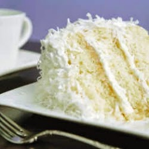

# Three Day Coconut Cake

## Ingredients
- 1 box yellow cake mix
- 2 pkg frozen coconut (or equivalent of dried coconut)
- 2 cups sugar
- 2 cups sour cream
- 9 oz. Cool Whip (can use more if desired)

## Steps
1. Prepare cake as directed on box.
2. Split into 3 layers.
3. Mix coconut, sugar, and sour cream;  set aside 3/4 cup of the mixture.
4. Use the rest as filling in between the layers.
5. Add the remaining 3/4 cup filling to the Cool Whip and frost the cake.
6. Cover loosely and refrigerate for 3 days (although you can eat it before, and it's still good)

## Notes