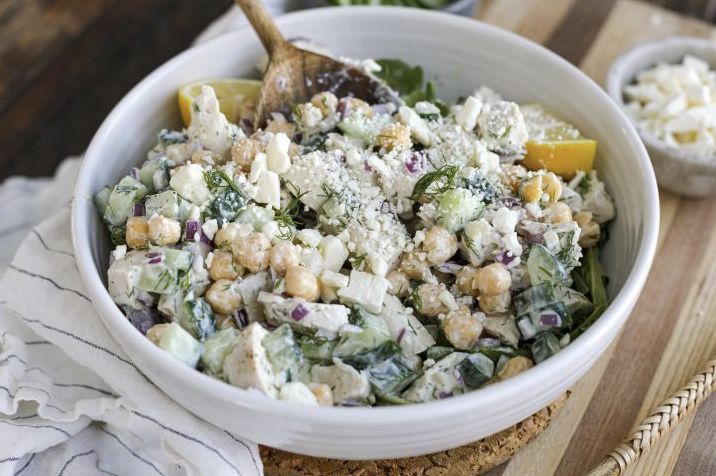

# Tzatziki Chicken Salad

## Ingredients
### Tzatziki Sauce
- 1 cup plain Greek yogurt
- 1/2 cucumber, grated
- 2 garlic cloves, pressed
- 2 Tbsp olive oil
- 2 Tbsp fresh dill, chopped
- Salt, to taste
- Pepper, to taste

### Salad
- 2 cups cooked, chopped chicken
- 2 cups romaine lettuce, chopped
- 1 cup grape tomatoes, halved
- 1/2 cup pepperoncini peppers, sliced
- 1/2 cup Kalamata olives, sliced
- 1/4 cup red onion, chopped
- 1/2 cup feta cheese, crumbled

## Steps
1. **Prepare Tzatziki**: In a bowl, mix together the Greek yogurt, grated cucumber, pressed garlic, olive oil, and chopped dill. Season with salt and pepper to taste.
2. **Assemble Salad**: In a large bowl, toss together the chopped romaine lettuce, grape tomatoes, pepperoncini peppers, Kalamata olives, and red onion.
3. **Combine**: Layer the chopped chicken over the salad base.
4. **Dress**: Generously top with the prepared tzatziki sauce.

## Notes
This refreshing salad combines the creaminess of tzatziki with the crunch of fresh vegetables and tender chicken.
